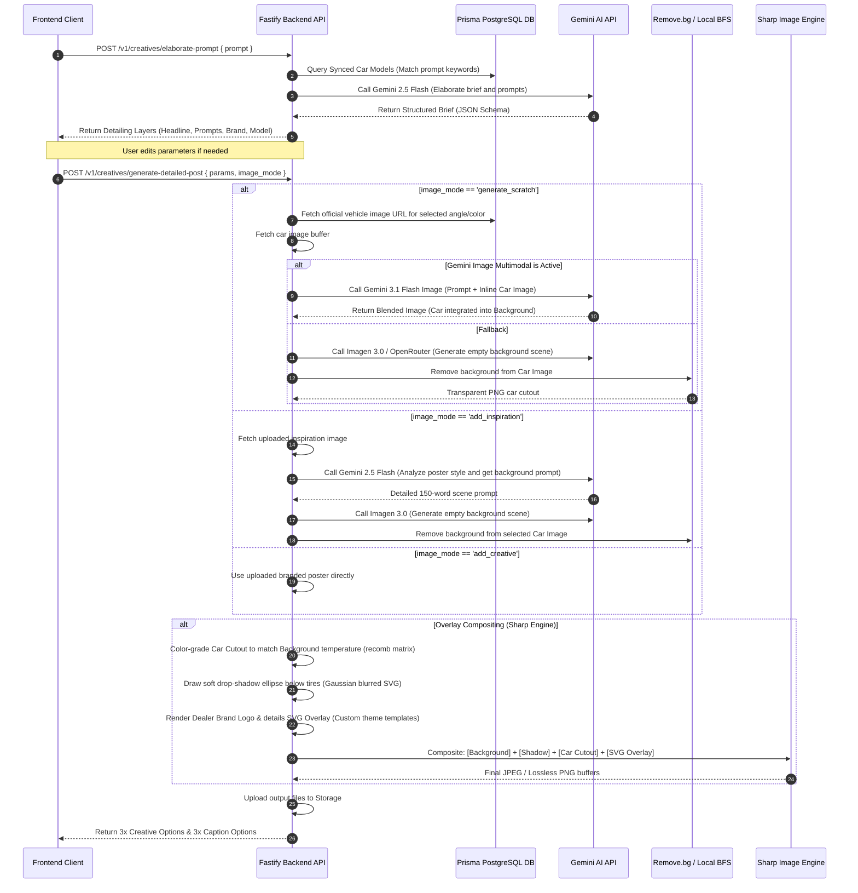

# Create Post & Creative Generation Module Specification

This document provides the technical specifications, architectural layouts, logic flows, and AI API integrations for the **Create Post & Creative Generation** module. It serves as a comprehensive reference for tech developers building the production version of the SaaS application.

---

## 1. UI/UX Design & Interaction Flow

The frontend is implemented as a responsive, dual-pane wizard that guides the dealer from raw campaign concepts to multi-channel social publishing.

```
+-----------------------------------------------------------------------------------+
|  <- Back   / CREATE SOCIAL POST             [Scheduling Info]  [Status Badge]     |
+-----------------------------------------------------------------------------------+
|  LEFT PANEL: FORM CONTROLS                   | RIGHT PANEL: LIVE WORKSPACE        |
|                                              |                                    |
|  [Section 1: Campaign & Visual Type]         |  * Before Generation:              |
|  - Raw Campaign Prompt (Textarea, max 400ch)  |    - Dashed Empty State Preview    |
|  - Visual Mode:                              |                                    |
|    [ Scratch AI ] [ Inspiration ] [ Upload ] |  * After Generation (Mix & Match): |
|  - Dynamic Target Vehicle Picker             |    - 3x Creative Visual Options    |
|    - Automatic Model Match from Prompt       |      (Grid with Zoom Lightbox)     |
|    - Customize View (Color & Angle Modal)    |    - 3x Copy Style Options         |
|  - [Generate Post] Button (Primary Action)   |      (Punchy, Detailed, Emotional) |
|                                              |    - [Checkout Selection] Button   |
|  [Section 2: Detail Layer & Parameters]      |                                    |
|  - Unlocked post-generation                  |  * After Checkout (Publish Setup): |
|  - Editable Fields: Headline, Car Angle,     |    - Mobile Platform Mockups      |
|    Lighting Mood, Background Scene Details   |      [Facebook] [Instagram] [GMB]  |
|  - [Regenerate Post] Button                  |    - Editable Final Caption       |
|                                              |    - Publish Platform Selectors   |
|                                              |    - [Schedule] / [Publish Now]   |
+-----------------------------------------------------------------------------------+
```

### Key UI Features

1. **Dual-Pane Split Screen Layout**
   * **Left Panel**: Form controls and detail layers. Ensures users can adjust parameters without losing visual context.
   * **Right Panel**: A dynamic viewport that shifts from selection grid (before checkout) to realistic smartphone mockups (after checkout).

2. **Step-by-Step Stepper Progress Overlay**
   * Triggered during generation. Displays real-time pipeline progress using an active stepper:
     1. Detailing Prompt Concept (LLM detailing layers)
     2. Generating background setting scene (Text-to-image API)
     3. Extracting car subject & lighting matching (Background removal & color recomb)
     4. Overlaying dealer branding details (Dynamic SVG compositing)
     5. Writing Hinglish post caption & tags (Copy generator)

3. **Dynamic Target Vehicle Picker**
   * **Auto-Matching**: A debounce handler (`450ms`) parses the prompt in real time. If a user types "Creta", the system queries the model library, automatically matches the vehicle, and loads its official colors and angles.
   * **Customizer Modal**: Allows manually swapping the color variant and camera angle (`front_exterior`, `rear_exterior`, `side_exterior`, `interior_dashboard`).

4. **Interactive Zoom Lightbox**
   * High-resolution full-screen preview of generated posters with transition animations, allowing selection of variants directly inside the zoomed view.

5. **Integrated Canvas Studio**
   * Integrates an advanced canvas editor where the user can manually reposition overlay texts, add/remove sticker badges, modify headlines, configure dynamic retail offer blocks, and apply procedural post filters.

---

## 2. Creative Generation Logic & Flow

The backend handles creative generation through a multi-stage pipeline using Fastify, Prisma, Sharp, and Google Gemini AI.

### Architectural Flowchart



### Core Image Pipelines

#### A. Scratch AI (`generate_scratch`)
Uses Google AI Studio's multimodal capabilities to blend subjects.
1. The backend fetches the official transparent/solid car image from the database matching the user's color and angle choice.
2. It sends the car image buffer together with the background details prompt to Gemini's multimodal generation model.
3. If Gemini performs the blend directly, it returns the final blended scene. If a traditional text-to-image fallback is used, the backend strips the background of the vehicle image and composites it.

#### B. Inspiration Recreate (`add_inspiration`)
1. The user pastes/uploads a reference banner they like.
2. A vision query is dispatched to `gemini-2.5-flash` to extract styling details:
   * **Prompt**: `Analyze this automotive advertisement image. Describe the style, scene setting, lighting, colors, and background theme in detail. Do not mention any overlay text or logos. Provide only a single highly-detailed prompt (100-150 words)...`
3. The returned prompt is modified into three aspect variations and passed to the image generator, then composited with the dealer's matched car library model.

#### C. Branded Creative (`add_creative`)
1. For dealerships that already have pre-designed creative assets, this mode acts as a pass-through.
2. The system retains the original image and generates copy/hashtags that match the visual campaign theme.

### Background Removal Engine
Implemented with a two-tier fallback architecture:
1. **Tier 1 (remove.bg API)**: Dispatches image to `https://api.remove.bg/v1.0/removebg` using the configured API key for studio-grade cutout quality.
2. **Tier 2 (Local BFS Chroma-Keyer Fallback)**: If the API key is missing or fails, a custom Breadth-First Search (BFS) pixel scanner traverses the image borders using Sharp. It targets white/light-grey studio backdrops, marks visited matching pixels, and sets their alpha values to `0` (transparent).

```typescript
// Criteria for studio background white / light-grey
const isTargetBg = (r: number, g: number, b: number) => {
  if (r > 245 && g > 245 && b > 245) return true;
  if (r > 215 && g > 215 && b > 215) {
    const maxDiff = 15;
    return Math.abs(r - g) <= maxDiff && Math.abs(r - b) <= maxDiff && Math.abs(g - b) <= maxDiff;
  }
  return false;
};
```

### Layered Compositing & Branding Engine (Sharp)
Composites up to four layers:
* **Layer 1 (Bottom)**: Background scene (resized to fill $1080 \times 1080$ cover).
* **Layer 2 (Shadow)**: Soft ground shadow ellipse.
* **Layer 3 (Subject)**: Color-graded vehicle cutout.
* **Layer 4 (Top Overlay)**: Dynamic SVG containing branding elements, logos, and headlines.

#### Ground Shadow Calculation
To ground the car cutout realistically, the system draws a custom SVG ellipse dynamically positioned at the bottom base of the car bounding box. It applies a standard Gaussian blur deviation equal to 2% of the canvas size and sets the opacity to `48%`.
```typescript
const shadowBlurRadius = Math.round(size * 0.02);
const shadowSvg = `
<svg width="${size}" height="${size}" xmlns="http://www.w3.org/2000/svg">
  <defs>
    <filter id="shadowBlur" x="-20%" y="-20%" width="140%" height="140%">
      <feGaussianBlur stdDeviation="${shadowBlurRadius}" />
    </filter>
  </defs>
  <ellipse cx="${size / 2}" cy="${size - footerHeight}" rx="${Math.round(subW * 0.46)}" ry="${Math.round(subH * 0.08)}" fill="#000000" opacity="0.48" filter="url(#shadowBlur)" />
</svg>
`;
```

#### Color Grade Temperature Matching
To blend the vehicle cutout with the background lighting mood, the Sharp instance applies a recombination matrix filter:
* **Warm light matching**: Adds red and green tints (`+6% Red, +2% Green, -6% Blue`).
* **Cool light matching**: Adds blue tints (`-6% Red, +1% Green, +8% Blue`).
```typescript
if (colorMood === 'warm') {
  subjectSharp = subjectSharp.recomb([[1.06, 0, 0], [0, 1.02, 0], [0, 0, 0.94]]);
} else if (colorMood === 'cool') {
  subjectSharp = subjectSharp.recomb([[0.94, 0, 0], [0, 1.01, 0], [0, 0, 1.08]]);
}
```

---

## 3. Dynamic Branding Templates (SVG Overlay Styles)

The branding overlay engine generates high-fidelity SVG graphics customized by template style:

| Template Style | Visual Vibe | Layout Features | Color Palette |
| :--- | :--- | :--- | :--- |
| **Festive** | Celebratory / High-Energy | Golden double borders, top scrim overlay, centered headline with drop shadow, white footer panel. | Slate-gray texts, `#facc15` gold highlights, primary brand color accents. |
| **Premium** | Luxury / Brand-Focused | Top scrim, elegant serif/italic headlines (`Georgia` / `Playfair Display`), solid dark slate footer panel with gold accent bar. | Warm light yellow headlines (`#fef9c3`), white dealer details. |
| **Value** | Offer / CTA-Oriented | Left-aligned heavy-weight block headlines, full solid primary brand colored footer panel, right-aligned white **"BOOK NOW"** CTA pill. | White bold text on primary brand color backdrop. |

---

## 4. AI APIs & Integration Specs

### A. Stage 1: Prompt Detailing & Elaboration
Structures the raw concept prompt into specific background prompts, copy variations, and templates.

* **API Endpoint**: `POST https://generativelanguage.googleapis.com/v1beta/models/gemini-2.5-flash:generateContent`
* **Configuration**: `responseMimeType: "application/json"`, temperature `0.85`
* **JSON Schema Response Structure**:
```json
{
  "type": "OBJECT",
  "properties": {
    "brand": { "type": "STRING" },
    "model_name": { "type": "STRING" },
    "car_angle": { "type": "STRING" },
    "background_theme": { "type": "STRING" },
    "background_details": { "type": "STRING" },
    "background_details_option2": { "type": "STRING" },
    "background_details_option3": { "type": "STRING" },
    "lighting_mood": { "type": "STRING" },
    "headline": { "type": "STRING" },
    "caption": { "type": "STRING" },
    "caption_option2": { "type": "STRING" },
    "caption_option3": { "type": "STRING" },
    "hashtags": { "type": "ARRAY", "items": { "type": "STRING" } },
    "hashtags_option2": { "type": "ARRAY", "items": { "type": "STRING" } },
    "hashtags_option3": { "type": "ARRAY", "items": { "type": "STRING" } }
  },
  "required": [
    "brand", "model_name", "car_angle", "background_theme", 
    "background_details", "background_details_option2", "background_details_option3", 
    "lighting_mood", "headline", "caption", "caption_option2", "caption_option3", 
    "hashtags", "hashtags_option2", "hashtags_option3"
  ]
}
```

### B. Stage 2: Multimodal Image Generation
Generates the blended visual containing the vehicle within the setting.

* **API Endpoint**: `POST https://generativelanguage.googleapis.com/v1beta/models/gemini-3.1-flash-image-preview:generateContent`
* **Configuration**: `responseModalities: ["IMAGE", "TEXT"]`
* **Payload Structure**:
```json
{
  "contents": [
    {
      "parts": [
        {
          "text": "Create a high-quality, professional automotive commercial poster. Seamlessly integrate the car from the attached photo into a new environment: [Option Prompt]. Place the car in the center of the image, resting realistically on the road or surface. Ground shadows, lighting, reflections, and color grading must look completely natural and cohesive. Preserve brand badges, headlights, and colors exactly. Do not add any text overlays or logos."
        },
        {
          "inlineData": {
            "mimeType": "image/jpeg",
            "data": "[Base64 Car Buffer]"
          }
        }
      ]
    }
  ]
}
```

### C. Stage 3: Text-to-Image Fallbacks
Used for generating background templates when multimodal blending is not active.

* **Google AI Studio (Imagen 3)**:
  * **Endpoint**: `POST https://generativelanguage.googleapis.com/v1beta/models/imagen-3.0-generate-002:predict`
  * **Payload**:
    ```json
    {
      "instances": [{ "prompt": "[Background Scene Prompt]" }],
      "parameters": { "sampleCount": 1, "aspectRatio": "1:1" }
    }
    ```
* **Cloudflare Workers AI (SDXL)**:
  * **Endpoint**: Cloudflare AI Gateway REST call to `@cf/stabilityai/stable-diffusion-xl-base-1.0`.
* **OpenRouter Image API**:
  * **Endpoint**: REST call to `https://openrouter.ai/api/v1/chat/completions` using image-generation models.

### D. Copy & Caption Generator
Generates Hinglish or Bilingual social media copy variants matching the dealership context.

* **API Endpoint**: `POST https://generativelanguage.googleapis.com/v1beta/models/gemini-2.5-flash:generateContent`
* **Configuration**: `responseMimeType: "application/json"`, temperature `0.85`
* **System Prompt Core**:
  ```
  You are an expert automotive copywriter and creative director for premium Indian car dealerships.
  Generate exactly 3 distinct creative options/variants, each with a different vibe/style:
  - Option 1: Celebratory/Festive or High-Energy (Hinglish mix of Hindi/English).
  - Option 2: Premium/Luxury or Brand-Focused (Professional conversational English).
  - Option 3: Value/Offer-Oriented or Call-To-Action (Bold marketing English).
  ```
